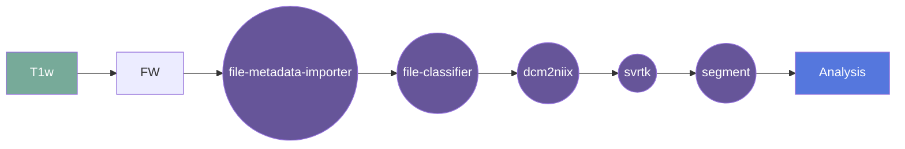

# SVRTK

**UNDER DEVELOPMENT**

__Wrapper for Flywheel gear__   
BOUNTI: Brain vOlumetry and aUtomated parcellatioN for 3D feTal MRI (1.5/3T, SS TSE, TE=80-250ms):

Source:
https://hub.docker.com/r/fetalsvrtk/segmentation

## Overview

[Usage](#usage)

[FAQ](#faq)

### Summary
An automated pipeline for fetal brain tissue segmentation (19 ROIs) for 3D SVR-reconstructed fetal brain MRI based on MONAI.

Please note that the network was trained on SS TSE 3D SVR reconstructed brain images.

The conditions for successful performance are (it won't work otherwise):

good image quality (clear visibility of all features, high SNR and smooth texture (not grainy), no extreme bias field artifacts)
reorientation to the standard radiological atlas space
full brain coverage
21 - 36 week GA
no extreme structural anomalies

### Cite
"BOUNTI: Brain vOlumetry and aUtomated parcellatioN for 3D feTal MRI" Alena U. Uus, Vanessa Kyriakopoulou, Antonios Makropoulos, Abi Fukami-Gartner, Daniel Cromb, Alice Davidson, Lucilio Cordero-Grande, Anthony N. Price, Irina Grigorescu, Logan Z. J. Williams, Emma C. Robinson, David Lloyd, Kuberan Pushparajah, Lisa Story, Jana Hutter, Serena J. Counsell, A. David Edwards, Mary A. Rutherford, Joseph V. Hajnal, Maria Deprez; bioRxiv 2023.04.18.537347; doi: https://doi.org/10.1101/2023.04.18.537347

**license:**
MIT License

**url:** <https://gitlab.com/flywheel-io/flywheel-apps/>

### Classification

*Category:* analysis

*Gear Level:*

* [ ] Project
* [ ] Subject
* [x] Session
* [ ] Acquisition
* [ ] Analysis

----

### Inputs

* api-key
  * **Name**: api-key
  * **Type**: object
  * **Optional**: true
  * **Classification**: api-key
  * **Description**: Flywheel API key.

### Config

* input
  * **Base**: file
  * **Description**: input file (required)
  * **Optional**: false

#### Metadata

No metadata currently created by this gear

### Pre-requisites

- Fetal MRI reconstruction 

#### Prerequisite Gear Runs

This gear runs on NIFTI data

1. ***dcm2niix***
    * Level: Any
2. ***file-metadata-importer***
    * Level: Any
3. ***file-classifier***
    * Level: Any

#### Prerequisite

## Usage

This section provides a more detailed description of the gear, including not just WHAT
it does, but HOW it works in flywheel

### Description

This gear is run at either the `Subject` or the `Session` level. It downloads the data
for that subject/session into the `/flwyhweel/v0/input` folder and then runs the
`auto-brain-bounti-segmentation-fetal` pipeline on it.

After the pipeline is run, the output folder is zipped and saved into the analysis
container.

#### File Specifications

This section contains specifications on any input files that the gear may need

### Workflow

A picture and description of the workflow

Description of workflow

1. Upload data to container
2. Prepare data by running the following gears:
   1. file metadata importer
   2. file classifier
   3. dcm2niix
3. Select either a subject or a session.
4. Run the svrtk-brain-reconstruction gear
5. Run the auto-brain-bounti-segmentation-fetal gear
6. Gear places output in Analysis

### Use Cases

## FAQ

[FAQ.md](FAQ.md)

## Contributing

[For more information about how to get started contributing to that gear,
checkout [CONTRIBUTING.md](CONTRIBUTING.md).]
